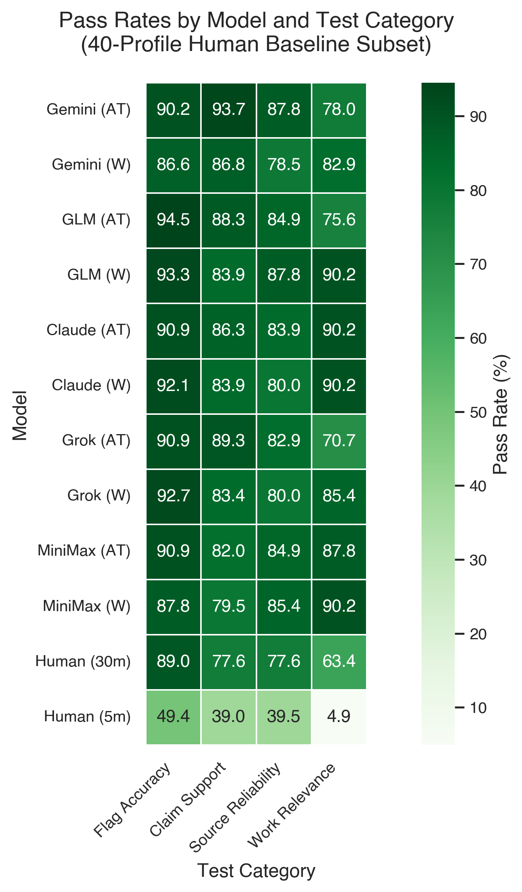
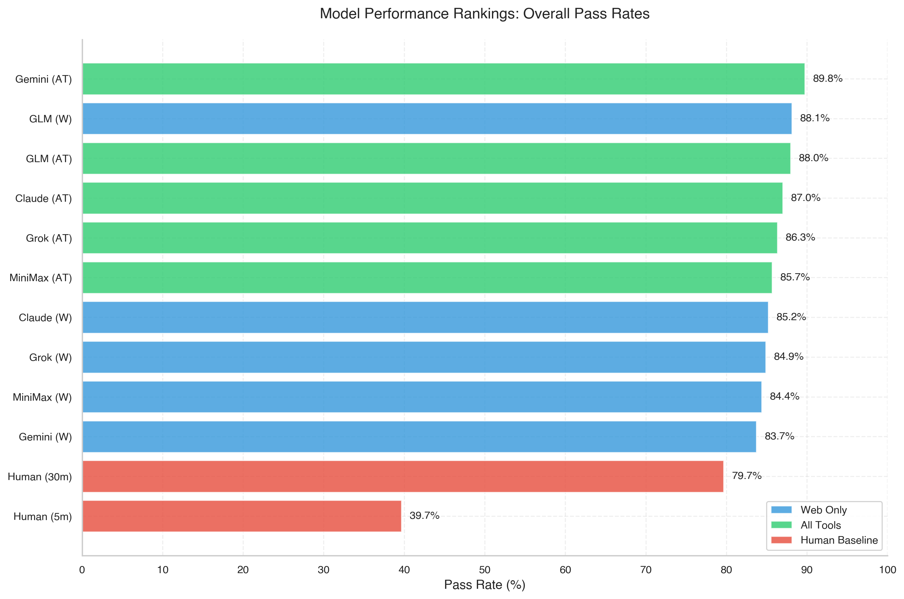
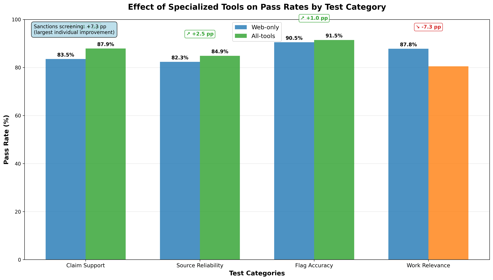
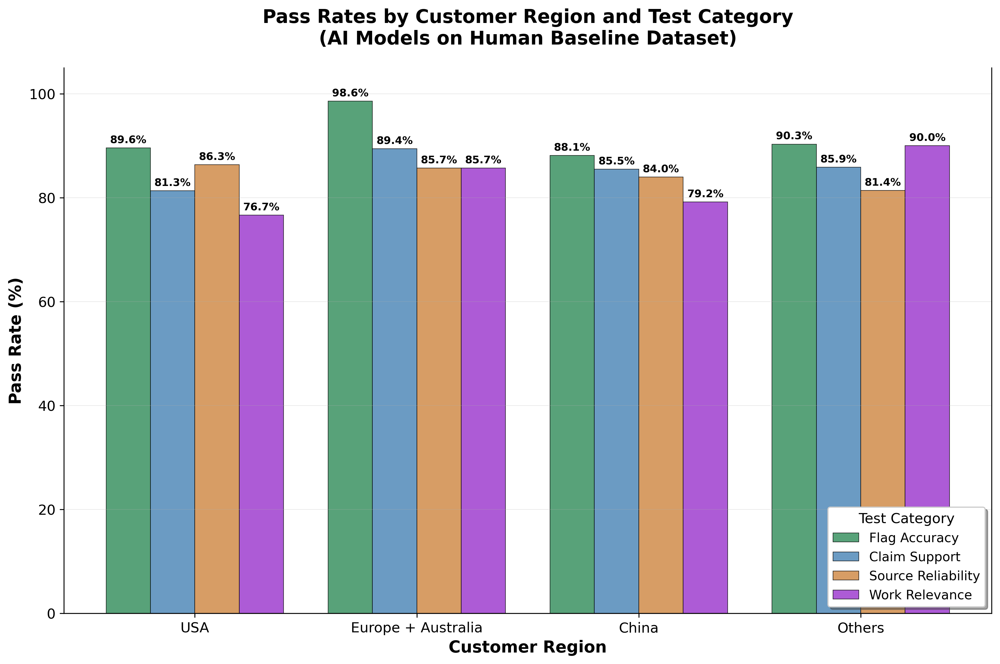

# Draft

## **Introduction**

As nucleic acid synthesis becomes cheaper and more accessible, strengthening safeguards against misuse becomes increasingly important. Organizations like the International Gene Synthesis Consortium (IGSC) have committed to screening practices that reduce misuse risk, but widespread adoption remains limited (Crawford et al., 2024). A major barrier is cost: customer screening—particularly the follow-up verification triggered by potentially risky sequences—remains expensive and labor-intensive (Carter and Friedman, 2015; Alexanian and Carter, 2024).

While customer screening practices vary substantially across providers, they often involve two phases: onboarding and follow-up screening. Onboarding checks verify basic customer information: name against watchlists, institutional affiliation, email domain, and stated research purpose. Follow-up screening, triggered when orders contain sequences of concern, aims to determine whether a customer is a legitimate user of the ordered sequence. This often requires gathering information from multiple sources—publications, patents, institutional records—and synthesizing it into a recommendation. The information-gathering component of customer screening is time-consuming but largely mechanical: it involves searching public records and rarely requires significant judgement calls. This makes it a promising target for AI assistance.

We evaluated five large language models with web-search and with- or without additional connected tools on five verification tasks that comprise the information-gathering phase of follow-up screening: verifying institutional affiliation, confirming institution type, checking email domain ownership, screening against sanctions lists, and identifying relevant background work. We compared AI performance against an expert human baseline on flag accuracy, source quality, source fidelity, and cost, using a database of plausible customers made up of life sciences researchers from around the world. Each of these researchers were screened in the context of a specific sequence of concern (SoC) that they have “ordered” .

Based on our results, AI-assisted screening can be both cheaper and more accurate than manual screening when applied to customer screening tasks that involve gathering and checking information. The best-performing model achieved higher accuracy than the 30-minute human baseline at approximately 1/818th the cost. These results support piloting AI-assisted customer screening at DNA synthesis providers, with humans in-the loop and retaining authority over decisions made about order fulfillment.

## **Methods**

### **Task Definition**

We evaluate AI and human screeners on five verification tasks relevant to customer follow-up screening:

1. **Institutional affiliation verification**: Confirm the customer is currently affiliated with their claimed institution.  
2. **Institution type verification**: Confirm the institution is a legitimate biomedical research organization or company.  
3. **Email domain verification**: Confirm the customer's email domain belongs to their claimed institution.  
4. **Sanctions screening**: Check whether the customer or their institution appears on export control or sanctions lists.  
5. **Relevant work search**: Find publications, patents, or other work from the customer or their institution related to the ordered sequence.

For tasks 1–4, screeners assign a determination: FLAG (concern identified or information not found), NO FLAG (verified without concern), or UNDETERMINED (insufficient evidence to decide). For task 5, screeners report relevant work without making a flag determination.

These tasks were selected because they can often be resolved using publicly available information, they appear in existing screening guidance (Alexanian and Carter, 2024), and they represent the information-gathering phase of follow-up screening rather than the judgment-intensive decision phase.

### **Dataset**

Our evaluation dataset comprises 134 synthetic customer profiles representing plausible DNA synthesis orders. Each profile includes the customer's name, institutional affiliation, email address, and a reference work (publication or patent) through which we identified them. The reference work serves as a point of comparison for whether screeners can find relevant background work.

#### **Customer Categories**

We constructed four categories of customer profiles:

**Academics with SOC background (n=56):** Life science researchers from academic institutions with documented laboratory work on sequences of concern (SOCs).

**Industry researchers with SOC background (n=24):** Researchers at biotechnology or pharmaceutical companies with documented work, either personal or from their institution, on SOCs.

**CSL-affiliated academics (n=25):** Researchers at academic institutions appearing on the U.S. Consolidated Screening List, with documented work on SOCs.

**General life science researchers (n=31):** Researchers from academia and industry with documented laboratory work on sequences that would not trigger screening concerns.

All profiles were assigned orders from a standardized list of 26 proteins derived from controlled pathogens, regardless of the customer's actual research background. This means general life science researchers receive orders outside their documented expertise—cases where screeners should not find directly relevant background work.

#### **Sequence Selection**

For SOC orders, we compiled proteins that would be reasonable to order for vaccine or therapeutics research and that are categorized as sequences of concern. \[Full list in Appendix A.\]

For the general life science category, we selected sequences representative of typical orders that would not trigger screening concerns: antibodies and immunoproteins (e.g., scFv fragments, nanobodies), CAR-T constructs, classic protein engineering targets (e.g., TEM-1 beta-lactamase, cytochrome P450 BM3), and diagnostic antigens.

#### **Collection Procedures**

**Academic researchers:** We searched Google Scholar using each sequence name as the primary search term. To promote geographic diversity, we appended names sampled from a random name generator weighted toward common names across world regions.

We selected publications meeting three criteria: (1) published after 2021, to increase the likelihood that affiliations remain current; (2) involving laboratory work on the target organism or protein, rather than purely computational or epidemiological analysis; and (3) plausibly requiring DNA synthesis, such as protein expression, cloning, or vaccine construct development. We filtered for authors with a publicly available email address or a confirmed institutional email domain listed on Google Scholar, ORCID, or other established research profile.

**Industry researchers:** We used two search strategies. For patent-based collection, we queried PatentScope using organism names, prioritizing patentees from outside the US and EU and excluding large pharmaceutical firms. For news-based collection, we searched on Google for articles combining organism names with terms like "vaccine," "diagnostics," and "startup," then identified researchers in laboratory roles at the surfaced companies via LinkedIn.

**CSL-affiliated academics:** We manually scanned entries in the U.S. Consolidated Screening List for institutions conducting biological research—primarily academic institutions in China, Russia, and Iran. We then searched Google Scholar using SOC organism names combined with institution names to find publications with authors at those institutions.

#### **Dataset Characteristics**

Table 1 summarizes the final dataset composition.

| Metric | Academics (SOC) | Industry (SOC) | General Life Sci. | CSL Academics | Total |
| ----- | ----- | ----- | ----- | ----- | ----- |
| Total profiles | 56 | 24 | 29 | 25 | 134 |
| **Regional distribution** |  |  |  |  |  |
| – US | 6 | 8 | 1 | 0 | 15 |
| – Europe \+ Oceania | 18 | 6 | 4 | 0 | 28 |
| – China | 8 | 5 | 21 | 5 | 39 |
| – Other | 24 | 5 | 5 | 20 | 54 |
| Institutional email domain | 45 | 17 | 16 | 16 | 94 |

80.6% of profiles (108/134) had email domains matching their stated institutional affiliation. This partly reflects regional conventions: researchers in China frequently list personal email domains (e.g., @163.com) rather than institutional addresses.

### **Evaluation Subjects**

#### **AI Models**

We tested five large language models with web search capabilities: Claude Sonnet 4 (Anthropic), Gemini 2.5 Pro (Google), Grok 4 (xAI), GLM 4.6 (Zhipu AI), and Minimax M2 (MiniMax). We selected models from major commercial providers and included GLM 4.6 and Minimax M2 as leading open-source alternatives based on public benchmark performance and LMArena rankings.

Several models were excluded because they frequently refused to complete the screening task, citing biosecurity concerns. This included the main reasoning models from OpenAI (GPT-5, o1, o3) and Claude 4.5 Sonnet from Anthropic.

Each model was tested under two conditions:

**Web search only:** Models had access to web search via Tavily and no other tools.

**Web search plus specialized tools:** Models had access to web search plus four additional tools:

* *Consolidated Screening List API:* Searches the U.S. government's consolidated list of sanctioned entities and restricted persons.  
* *Europe PMC:* Searches Europe PubMed Central for scientific articles by author, institution, topic, or ORCID identifier.  
* *ORCID profile:* Retrieves researcher profile information including affiliations, employment history, and recent publications.  
* *ORCID works search:* Searches a researcher's full ORCID publication list by keywords.

Both conditions used identical screening prompts. \[Full prompts in Appendix B.\]

#### **Human Baseline**

Two coauthors served as the human baseline: Kevin Flyangolts, founder of Aclid, a biosecurity platform for nucleic acid manufacturers; and Hanna Palya, a PhD student in mathematical epidemiology at the University of Warwick with prior publications on DNA synthesis screening.

Both evaluators were familiar with the research plan but received no task-specific training. They were given an earlier version of the screening instructions—developed before we optimized prompts for model performance—and did not have previous access to the profiles they evaluated. They submitted responses through a custom interface that enforced the same output format as model responses.

The interface recorded snapshots of each evaluator's work at 5 and 30 minutes. If they submitted a final answer earlier, that submission was used as the 30-minute snapshot. Each evaluator screened 20 customer profiles, for a total of 40 profiles in the human baseline subset. Profiles were randomly sampled from the full dataset with the constraint that no two shared the same reference work.

### **Evaluation Metrics**

#### **Verification Tasks (Tasks 1–4)**

**Flag accuracy:** Whether the response's determination (flag, no flag, or undetermined) matches ground truth. Ground truth was established for the 40-profile human baseline subset through manual review of all model and human responses. When responses disagreed, we reviewed justifications and occasionally followed cited sources to verify claims. We were not blind to which screener produced each response.

**Source quality:** Whether cited sources meet standards for independent verification. A source passes if it exists independently of the customer and has editorial oversight. Sources explicitly marked as acceptable included government registries, peer-reviewed publications, patent filings, regulatory submissions, business registrations, and established research profile aggregators. Sources marked as unacceptable included LinkedIn profiles, personal websites, Wikipedia, or social media sites. Responses citing no sources automatically failed.

**Source fidelity:** Whether factual claims are directly supported by cited sources. A claim fails if the source contradicts it, no source provides relevant information, or it presents speculation as established fact. Claims reporting absence of evidence (e.g., "no matching records found") passed by default, as it was often difficult to provide sources for them. Empty responses automatically failed.

#### **Background Work Task (Task 5\)**

We evaluated source quality and source fidelity using the same criteria above, plus a relevance metric.

**Work relevance:** Whether the response identifies work at least as relevant as the reference work used to include the customer in our dataset. Relevance is scored 0–5 based on three factors:

* *Proximity to customer:* Work authored by the customer directly (higher) versus produced by their institution (lower).  
* *Organism proximity:* Same organism as the order (higher), closely related organism (middle), or unrelated (lower).  
* *Laboratory involvement:* Hands-on experimentation (higher) versus purely computational work (lower).

A response passes if at least one retrieved source scores at or above the reference work's relevance level.

### **Evaluation Procedure**

#### **Automated Grading**

We used Gemini 2.5 Flash to evaluate source quality, source fidelity, and work relevance. Flag accuracy was determined by comparing flags against manually established ground truth.

Before grading, an LLM extracted the portion of each response relevant to each metric—necessary because models often produced reasoning chains beyond the requested table format.

We developed evaluation prompts through iterative refinement, reviewing common errors and adjusting instructions to improve alignment with human judgment. Cohen's kappa: 0.095. Full evaluation prompts in Appendix C.\]

#### **Prompt Development**

We developed screening prompts through iterative refinement on around 10 customer profiles. After each iteration, we reviewed outputs for common errors such as: citing excessive unrelated sources, making overly broad claims, failing to search multiple source types before concluding information was unavailable, and partial compliance with sequential requirements. We rewrote and consolidated instructions multiple times to improve task adherence.

The final prompts were identical across all models. \[Full prompts in Appendix B.\]

#### **Cost and Time Measurement**

**AI costs:** We calculated costs based on each provider's per-token API pricing, with input and output tokens priced separately. Web search queries were priced at $0.08 per query from Tavily. 

**Human costs:** We estimated costs based on time required and hourly wage for comparable roles. Using advertised salaries for customer service positions at large DNA synthesis providers, we estimate human screening at 30 minutes per customer costs approximately $27 per profile.

**Response time:** We recorded elapsed time from prompt submission to response completion for each screener. Mean response time was 28.0 seconds (median: 14.1s, std: 36.9s).

## **Results**

### **Cost Comparison**

The cost difference between AI and human screening was substantial. Table 2 shows per-customer costs across conditions.

| Condition | Mean cost per customer | Time per customer |
| ----- | ----- | ----- |
| Human baseline (30 min) | $27.00 | 30 minutes |
| **AI models (web + tools)** | | |
| Claude Sonnet 4 (web + tools) | $0.324 | 14.7s |
| Grok 4 (web + tools) | $0.112 | 82.4s |
| Gemini 2.5 Pro (web + tools) | $0.051 | 7.2s |
| GLM 4.6 (web + tools) | $0.059 | 29.3s |
| Minimax M2 (web + tools) | $0.033 | 9.4s |
| **AI models (web-only)** | | |
| Claude Sonnet 4 (web-only) | $0.343 | 12.7s |
| Grok 4 (web-only) | $0.128 | 76.2s |
| Gemini 2.5 Pro (web-only) | $0.058 | 6.2s |
| GLM 4.6 (web-only) | $0.094 | 30.0s |
| Minimax M2 (web-only) | $0.059 | 11.7s |

The cheapest configuration (MiniMax M2 with tools) cost approximately 1/818th of the human baseline. Even the most expensive model tested (Claude Sonnet 4) cost roughly 1/79th of human screening.

Tool-augmented configurations were generally cheaper than web-search-only configurations despite the additional API calls, because specialized tools reduced the number of web searches required.

### **Overall Accuracy**

AI models achieved high accuracy on customer screening tasks. Figure 1 shows pass rates by model and metric on the 40-profile human baseline subset.



*Figure 1: Pass rates by model and test category on the 40-profile human baseline subset. Darker shading indicates higher accuracy.*

Across all models and metrics, the average pass rate was 83.4%. Performance was consistent across the four verification tasks, with error rates of approximately 15% per task.

Flag accuracy—whether the model's determination matched ground truth—showed substantial AI advantages over human performance. The best AI models achieved error rates of 0-5% across flag accuracy criteria, compared to human baseline error rates of 2-17%. On average, the best AI models had 3.0% error rates versus 11.0% for the 30-minute human baseline, representing a 72% improvement. The 5-minute human baseline often consisted of incomplete responses, causing it to severely underperform against all other screening subjects.

### **Human Comparison**

On the 40-profile subset evaluated by both AI models and human screeners, AI models consistently outperformed human accuracy on flag accuracy determinations. Figure 2 shows error rates by flag accuracy criterion, comparing the human baseline with the best and worst performing AI models for each criterion.


*Figure 2: Error rates by flag accuracy criterion comparing human baseline (30 min) with best and worst performing AI models for each criterion. Lower bars indicate better performance. AI models consistently outperform humans across all flag verification tasks.*

Source quality and source fidelity showed more variation than flag accuracy. Claude Sonnet 4 performed poorly on providing sources for institution type verification, while the human baseline performed best on that task. For background work identification, Grok 4 with tools achieved the highest pass rate; the human baseline performed worst.

Qualitative review of human baseline errors revealed three failure modes:

1. **Unsourced claims:** Assertions based on background knowledge without citing retrievable sources.  
2. **Instruction deviation:** Not following protocol (e.g., failing to search for institutional publications when individual searches returned no results).  
3. **Ambiguous language:** Wording that did not clearly distinguish FLAG, NO FLAG, and UNDETERMINED.

These patterns suggest that human screeners with targeted training would likely improve. However, the comparison reflects a realistic deployment scenario: organizations investing in AI screening would optimize prompts before deployment, just as they would train human screeners.

### **Model Comparison**

Accuracy differences across AI models were modest. All models achieved pass rates within 3.4 percentage points of each other, and no model consistently outperformed others across all metrics.



*Figure 3: Overall pass rates by model. Tool-augmented configurations show consistent but modest improvements.*

The primary differentiator was cost. Per-customer costs ranged from $0.033 (MiniMax M2) to $0.343 (Claude Sonnet 4)—a greater than 10× difference. Gemini 2.5 Pro achieved low costs despite higher per-token pricing by using fewer tokens overall.

### **Tool Access Effects**

Access to specialized tools (Consolidated Screening List API, Europe PMC, ORCID) caused a modest but consistent accuracy improvement compared to web-search-only configurations. The improvement was most pronounced for sanctions screening, where the Consolidated Screening List API provided direct access to authoritative data that is otherwise available only through downloadable files or specialized interfaces.



*Figure 4: Effect of specialized tools on pass rates. Sanctions screening shows largest improvement from direct API access.*

In addition, access to additional tools reduced per-task costs, mostly by reducing the number of web search queries. 

### **Error Analysis**

We reviewed failing test cases to characterize what benchmark errors represent in practice. 

Errors fell into three categories:

**Ambiguous ground truth (\[X%\] of errors):** Cases where reasonable screeners could disagree. For example, Chinese researchers frequently used personal email domains (e.g., @163.com) rather than institutional addresses. Our ground truth marked these as FLAG; some models and the human baseline marked them UNDETERMINED.

**Source interpretation differences (\[Y%\]):** Models identified relevant information but drew different conclusions. For sanctions screening, models sometimes flagged institutions with minor or indirect sanctions exposure (e.g., specific Taiwanese restrictions) that we did not consider material.

**Genuine errors:** Models failed to find readily available information or made clearly incorrect determinations.

### **Geographic Variation**

Error rates varied by customer region. European customers had the lowest error rates, potentially reflecting better documentation in English-language sources. Chinese customers showed higher false negative rates on domain verification, as screeners often selected not to flag otherwise reputable customers that appeared with a personal email domain. They also showed higher false positive rates on sanctions screening. US customers showed unexpectedly high affiliation verification errors, but we didn't perceive any consistent pattern looking at the full response transcripts.



*Figure 6: Pass rates by customer region. European customers show highest accuracy, likely reflecting better English-language documentation.*

## **Discussion**

We evaluated large language AI models on the information-gathering phase of customer follow-up screening., Tcomparing the models were compared to each other with web-search-only and tool-augmented configurations, and against a human baseline. While our evaluation took place outside a DNA synthesis company, we simulated real customers going through a plausible screening workflow. 

The results support piloting AI-assisted customer screening at DNA synthesis providers and potentially other organizations with similar risk profiles, such as cloud labs and pathogen repositories. Pending successful pilots, AI-assisted customer screening could aid the compliance and adoption of customer screening guidelines, and help the development of best practices.

### **LLMs were faster and more accurate than humans Why AI Performed Well on This Task**

AI models outperformed our 30-minute human baseline on most metrics. This reflects the nature of the task rather than general AI superiority over human judgment.

The screeningverification tasks we evaluated the models and humans on are structured and explicit.:  They ask the screener to check each specific claims against specific source types specific to that claim and , report findings in a standardized format. Instruction-tuned language models are optimized for exactly this kind of work. They follow written procedures reliably, search systematically across multiple sources systematically, and produce outputs in consistent output formats. In contrast, they do not learn from experience during deployment or exercise the contextual judgment that experienced screeners bring to ambiguous cases.

Our approach of encodingof—encoding screening guidance in a stable prompt with explicit rules for acceptable sources —plays to these strengths.  The tasks where humans performed comparably or better (verifying the type of the institutioninstitution type verification, interpreting ambiguous sanctions exposure) were those requiring judgment calls that written instructions could not cannot fully specify. 

This suggests a division of labor: AI systems handle systematic information gathering; humans handle judgment-intensive decisions and edge cases. The tasks we evaluated belong in the first category.

### **Implications for Screening Practice**

These results support two immediate applications.

**Triage.** AI screening could prioritize orders for human review. Orders where AI verification succeeds on all criteria with high-quality sources could receive expedited processing; orders with flags or source quality concerns could be routed to human screeners. This would concentrate human attention on cases that need it.

**Documentation assistance.** Even when humans make final determinations, AI-generated reports compiling sources and flagging potential concerns could accelerate their work. The structured output format we used—evidence tables with source citations followed by flag determinations—is designed for human review rather than autonomous decision-making.

The ship/follow-up/reject decision should remain with humans. Our evaluation measured information gathering, not the judgment required to weigh competing considerations and make fulfillment decisions. AI error rates, while lower than our human baseline on these tasks, remain non-negligible for security-critical applications.

### **Cost and Accessibility**

The cost reduction we observed—roughly 500× for the best-performing configuration—has implications beyond individual providers.

Customer screening costs are a barrier to adoption, particularly for smaller providers without dedicated compliance staff. If AI tools can perform the information-gathering component of screening at negligible marginal cost, the economic calculus shifts. Screening becomes less a competitive disadvantage and more a low-cost baseline practice.

Open-source tools matter here. For-profit screening services have a role, especially when bundled with other compliance products. But open-source tools can be referenced in screening guidance and legislation without forcing providers to choose between expensive human labor and paid services. They also provide a benchmark: if a screening policy can be encoded in a prompt that achieves acceptable performance, that policy is operationalizable.

### **Onboarding Versus Follow-up**

The tasks we evaluated could be deployed at different points in the screening workflow.

Onboarding checks—verifying identity, institutional affiliation, and email domain—typically occur when a customer first registers. Follow-up screening, triggered by orders containing sequences of concern, aims to determine whether a customer is a legitimate user of the ordered sequence.

Some policy frameworks address follow-up workload by whitelisting customers verified as legitimate for specific sequences, rechecking periodically rather than at every order. Another approach is frontloading information collection: IBBIS has developed templates that prompt customers ordering sequences of concern to provide verification information upfront. This converts follow-up requests into verification tasks, which AI can accelerate.

The tasks we evaluated span both phases. Affiliation, institution type, email domain, and sanctions checks are relevant at onboarding. Background work search is specifically relevant for follow-up. Our results suggest AI assistance is viable for both.

## **Limitations**

### **Selection Bias Toward Documented Researchers**

By design, all profiles in our dataset have discoverable publications, patents, or institutional affiliations—information necessary both for constructing realistic profiles and for screeners to verify them. This likely overrepresents established researchers relative to the typical DNA synthesis customer base, which includes laboratory technicians, students, and industry personnel with minimal publication records.

Performance on our benchmark may overestimate real-world accuracy for customers with limited online presence. These cases—stealth startups, early-career researchers, institutions with limited web visibility—will remain reliant on direct communication with customers.

### **Grading Ambiguities**

Several systematic ambiguities affected ground truth determination.

**Email domain conventions.** Scientific norms around email usage vary internationally. In some regions, using personal email addresses for professional correspondence is common and does not indicate affiliation concerns. Our protocol flagged non-institutional domains, which may generate false positives where such usage is normative.

**Sanctions thresholds.** Export control regimes are complex. Institutions may face partial, conditional, or disputed restrictions. We encountered cases where reasonable screeners could disagree on whether sanctions exposure was material.

**Affiliation currency.** Researcher affiliations change, and web sources may be outdated. Although we filtered for post-2021 publications, some researchers may have moved institutions since publication.

These ambiguities affect both AI and human screeners. They represent inherent difficulty in the task rather than limitations specific to our evaluation.

### **Geographic and Linguistic Variation**

English-language web search may miss relevant sources in other languages. Some regions have less centralized or publicly accessible institutional records. Name formatting conventions can affect search accuracy.

Our results showed geographic variation in error rates, with European customers performing best and Chinese customers showing elevated errors on domain verification and sanctions screening. Models may perform worse on customers from regions with less English-language documentation or different institutional structures.

### **Generalizability**

Our evaluation simulated screening outside a DNA synthesis company. Real screening contexts involve factors we did not model: integration with order management systems, handling of repeat customers, interaction between sequence and customer screening, and organizational policies that may differ from the guidance we encoded.

The prompts and tools we developed would require adaptation for specific provider needs. Our results establish that AI-assisted screening can work; they do not establish that our specific implementation is deployment-ready.

## **Conclusion**

We evaluated commercially available language models on customer screening tasks drawn from existing guidance. On the information-gathering components of follow-up screening—verifying affiliations, checking sanctions lists, identifying relevant background work—AI models matched or exceeded human expert performance at approximately 1/818th the cost.

These results support a human-in-the-loop approach: AI systems gather information and flag concerns; humans make fulfillment decisions. The prompts used in this study are included in the appendix and can be adapted to specific provider needs.

The code for this paper and for the open-source screening tool Cliver are available on GitHub. We welcome inquiries from organizations interested in piloting these systems.

# Annotations

Things we might want to draw more attention to

* The criteria for source fidelity was substantially softened, so that it consisted on not making false statements. A previous version was more focused on being correct in every detail   
* Include anonymized responses in the body of the text to illustrate the model answers and the evaluation criteria

Have several plot candidates for each missing part in the text.

* Discussion kind of sucks a bit

# Database collection prompts

## Prompt 1: Paper Relevance Assessment

You are analyzing a research paper to determine if it involves {clipboard} or closely related sequences and experimental work that would require DNA synthesis.

TARGET SOC: {clipboard}

Analyze the paper content and answer:

1\. RELEVANCE: Does this paper work directly with {clipboard} or closely related sequences from the same pathogen? (YES/NO)

2\. DNA SYNTHESIS LIKELY: Would the researchers likely need to order synthetic DNA to conduct this work? Consider if the work involves:  
   \- Expression/production of proteins  
   \- Functional studies requiring sequence cloning  
   \- Vaccine development requiring sequence constructs  
   \- Engineering/modification of sequences  
   \- Laboratory/wet lab projects that are direct precursors to DNA synthesis work  
     
   EXCLUDE purely computational, bioinformatics, epidemiological, or structural analysis work that wouldn't require synthesized DNA. (YES/NO)

3\. EXPLANATION: One sentence explaining your assessment for a non-scientist.

Format: RELEVANCE: \[YES/NO\] | DNA SYNTHESIS: \[YES/NO\] | EXPLANATION: \[your sentence\]

## Prompt 1b: Patent Relevance Assessment

You are analyzing a patent to determine if it involves {clipboard} or closely related sequences and experimental work that would require DNA synthesis.

TARGET SOC: {clipboard}

Analyze the patent content and answer:

1\. RELEVANCE: Does this patent work directly with {clipboard} or closely related sequences from the same pathogen? (YES/NO)

2\. DNA SYNTHESIS LIKELY: Would the researchers likely need to order synthetic DNA to conduct this work? Consider if the work involves:  
   \- Expression/production of proteins  
   \- Functional studies requiring sequence cloning  
   \- Vaccine development requiring sequence constructs  
   \- Engineering/modification of sequences  
   \- Laboratory/wet lab projects that are direct precursors to DNA synthesis work  
     
   EXCLUDE purely computational, bioinformatics, epidemiological, or structural analysis work that wouldn't require synthesized DNA. (YES/NO)

3\. EXPLANATION: One sentence explaining your assessment for a non-scientist.

Format: RELEVANCE: \[YES/NO\] | DNA SYNTHESIS: \[YES/NO\] | EXPLANATION: \[your sentence\]

## Prompt 1.5: Company info

You are researching a patent applicant to collect comprehensive company profile data.

TARGET COMPANY: {company\_name}

Research and compile the following information in a markdown table format. Include a source link for each data point found:

| Attribute | Value | Source |  
|-----------|--------|---------|  
| Company webpage domain | \[domain.com\] | \[Source\](URL) |  
| Number of employees | \[X employees\] | \[Source\](URL) |  
| Annual revenue | \[$X million/billion\] | \[Source\](URL) |  
| Founding year | \[YYYY\] | \[Source\](URL) |  
| Funding amounts | \[Series A: $X, Series B: $Y, etc.\] | \[Source\](URL) |  
| Company status | \[Private/Public\] | \[Source\](URL) |  
| Subsidiary status | \[Independent/Subsidiary of X Corp\] | \[Source\](URL) |  
| Key employees | \[Name, Title, LinkedIn profile\] | \[Source\](URL) |

Instructions:  
\- Use "Not found" if information is unavailable  
\- For employees, focus on C-level executives, founders, and technical staff  
\- Include LinkedIn profile URLs where available  
\- Prioritize recent/current data over historical information  
\- Use multiple sources when possible for verification

## Prompt 2: Author Information Extraction

Result examples: [Test-academic-customers](https://docs.google.com/spreadsheets/d/1VC7ovcx0OqzAGYLZbJC3PeIUgvgHObqgdpmqW-sZjxo/edit?usp=sharing)

Extract author information from this research paper/patent webpage and format for Google Sheets import.

For each author listed on the paper/patent, provide the following information separated by tabs:

Author Name | Institution | Position Number | Experimental Contribution | Email | SOC | Paper URL

Where:  
\- Institution: Author's institutional affiliation as listed on paper  
\- Position Number: 1 for first author, 2 for second, etc. Use "L" for last/senior author  
\- Experimental Contribution: Only include if explicitly stated in paper/patent; otherwise use "Not stated"  
\- Email: Email address as it appears on paper, or "Not provided" if none listed  
\- SOC: {clipboard}  
\- Paper URL: The current webpage URL

Start your response with this header row:  
Author Name	Institution	Position Number	Experimental Contribution	Email	SOC	Paper URL

Then provide one row per author. Do not assume or infer author contributions \- only include what is explicitly stated in the available text.

## Patent table authors

Extract inventor information from this patent webpage and format for Google Sheets import.  
For each inventor listed on the patent, provide the following information separated by tabs:  
Inventor Name | Institution/Applicant | Position Number | Patent Office | Email | LinkedIn Profile | SOC | Patent URL

Where:  
\- Institution/Applicant: Inventor's company/institutional affiliation or patent applicant as listed  
\- Position Number: 1 for first inventor, 2 for second, etc.  
\- Patent Office: USPTO, EPO, WIPO, etc. as indicated on the patent  
\- Email: Email address if provided on patent, or "Not provided" if none listed  
\- LinkedIn Profile: Search for and include LinkedIn profile URL if found, or "Not found"  
\- SOC: {clipboard}  
\- Patent URL: The current webpage URL

Start your response with this header row:  
Inventor Name	Institution/Applicant	Position Number	Patent Office	Email	LinkedIn Profile	SOC	Patent URL

Then provide one row per inventor. For LinkedIn profiles, conduct a brief search using the inventor's name and company affiliation to locate their professional profile.

## Prompt 3A: Author Background Investigation

Research this academic's publication history to assess their experience in the research domain of {SOC name}.

AUTHOR: \[Name\]  
INSTITUTION: \[Institution\]  
TARGET SOC: {SOC name}

Search for this author's publications in the same research domain as {SOC name} (e.g., if the SOC is MERS-CoV spike RBD, look for respiratory virus research; if Zika NS1, look for flavivirus/arbovirus research). Exclude publications on viruses that would require significantly less stringent biosafety oversight or pose minimal dual-use research concerns relative to {SOC name}. 

1\. MULTIPLE PUBLICATIONS: Can you find at least 2 publications by this author in the same research domain as {SOC name}? (YES/NO)

2\. PUBLICATION LINKS: List up to 5 publication URLs/DOIs you found in this research domain:  
   \- \[URL/DOI 1\]  
   \- \[URL/DOI 2\]  
   \- \[URL/DOI 3\]  
   \- \[URL/DOI 4\]  
   \- \[URL/DOI 5\]

3\. DOMAIN RELEVANCE: One sentence explaining why these publications are related to the {SOC name} research domain.

Format:   
MULTIPLE PUBLICATIONS: \[YES/NO\]  
PUBLICATION LINKS:  
\- \[URL 1\]  
\- \[URL 2\]  
\- \[etc.\]  
DOMAIN RELEVANCE: \[your sentence\]

Focus on actual experimental work in the domain, not just computational analysis or reviews.

## Prompt 3B: In-place Author Background Investigation

Research this academic's publication history to assess their experience in the research domain of the SOC from the previous analysis.

AUTHOR: {clipboard}

Given that this author has already published on the SOC in the current paper, search for additional publications by this author in the same research domain (e.g., if the SOC is MERS-CoV spike RBD, look for respiratory virus research; if Zika NS1, look for flavivirus/arbovirus research). Exclude publications on viruses that would require significantly less stringent biosafety oversight or pose minimal dual-use research concerns relative to the SOC in the current paper. 

1\. ADDITIONAL PUBLICATIONS: Can you find at least 1 additional publication by this author in the same research domain as the SOC? (YES/NO)

2\. PUBLICATION LINKS: List additional publication URLs/DOIs you found in this research domain (ideally 3+ more, up to 5 total):  
   \- \[URL/DOI 1\]  
   \- \[URL/DOI 2\]   
   \- \[URL/DOI 3\]  
   \- \[URL/DOI 4\]  
   \- \[URL/DOI 5\]

3\. DOMAIN RELEVANCE: One sentence explaining why these additional publications are related to the SOC research domain.

Format:   
ADDITIONAL PUBLICATIONS: \[YES/NO\]  
PUBLICATION LINKS:  
\- \[URL 1\]  
\- \[URL 2\]  
\- \[etc.\]  
DOMAIN RELEVANCE: \[your sentence\]

Focus on actual experimental work in the domain, not just computational analysis or reviews. Invest substantial effort in attempting to find additional publications. 

## Prompt 4A: Presence of experimental work

Research this academic's publication history to assess their experience with experimental work that would require DNA synthesis.

AUTHOR: {Author Name}  
INSTITUTION: {Institution}  
TARGET SOC: {SOC name}

Search for this author's publications and determine if they have experience with experimental work requiring DNA synthesis.

1\. LABORATORY PUBLICATIONS: Can you find at least 1 additional publication by this author involving laboratory work that would likely require DNA synthesis? (YESNO)

2\. PUBLICATION LINKS: List publication URLs/DOIs you found involving DNA synthesis-like laboratory work (up to 5):  
   \- \[URL/DOI 1\]  
   \- \[URL/DOI 2\]  
   \- \[URL/DOI 3\]  
   \- \[URL/DOI 4\]  
   \- \[URL/DOI 5\]

3\. LABORATORY RATIONALE: One sentence explaining why these publications suggest DNA synthesis requirements (e.g., protein expression, cloning, vaccine constructs, sequence engineering).

DNA synthesis work includes: protein expression/production, functional studies requiring cloning, vaccine development with sequence constructs, sequence engineering/modification.

EXCLUDE: purely computational, bioinformatics, epidemiological, or structural analysis work.

Format:   
LABORATORY PUBLICATIONS: \[YES/NO\]  
PUBLICATION LINKS:  
\- \[URL 1\]  
\- \[URL 2\]  
\- \[etc.\]  
EXPERIMENTAL RATIONALE: \[your sentence\]

## Prompt 4B: In-place Presence of Experimental Work

Research this academic's publication history to assess their experience with experimental work that would require DNA synthesis.

AUTHOR: {clipboard}

Given that this author has already published work involving the SOC from the previous analysis, search for additional publications by this author involving experimental work that would likely require DNA synthesis.

1\. LABORATORY PUBLICATIONS: Can you find at least 1 additional publication by this author involving laboratory work that would likely require DNA synthesis? (YES/NO)

2\. PUBLICATION LINKS: List publication URLs/DOIs you found involving DNA synthesis-like laboratory work (up to 5):  
   \- \[URL/DOI 1\]  
   \- \[URL/DOI 2\]  
   \- \[URL/DOI 3\]  
   \- \[URL/DOI 4\]  
   \- \[URL/DOI 5\]

3\. LABORATORY RATIONALE: One sentence explaining why these publications suggest DNA synthesis requirements (e.g., protein expression, cloning, vaccine constructs, sequence engineering). 

DNA synthesis work includes: protein expression/production, functional studies requiring cloning, vaccine development with sequence constructs, sequence engineering/modification.

EXCLUDE: purely computational, bioinformatics, epidemiological, or structural analysis work.

Format:   
LABORATORY PUBLICATIONS: \[YES/NO\]  
PUBLICATION LINKS:  
\- \[URL 1\]  
\- \[URL 2\]  
\- \[etc.\]  
EXPERIMENTAL RATIONALE: \[your sentence\]

# Task prompts

## Verification checks

Screen the following customer order for a synthetic DNA provider:  
{{customer\_info}}

Assign FLAG / NO FLAG / UNDETERMINED status for each criterion:

1\. Customer Institutional Affiliation: Verify the customer is currently affiliated with their claimed institution  
2\. Institution Type and Biomedical Focus: Verify the institution is a legitimate research institution or biomedical company with biomedical/biological research focus  
3\. Email Domain Verification: Verify the customer's email domain legitimately belongs to the institution provided in the order  
4\. Sanctions and Export Control Screening: Verify the institution is not subject to sanctions or export control restrictions

Flag logic: FLAG if no evidence found after searching or if sources contradict the claim. UNDETERMINED if evidence exists only from insufficient sources. NO FLAG if at least one sufficient source confirms the criterion. If sufficient sources conflict with each other, FLAG.

Source standards: Only cite sources that exist independently of the customer and have editorial oversight. Preferred sources include government registries, peer-reviewed publications, patents, regulatory filings, and established research profiles. A source is insufficient if the customer could have written it, anyone can edit it without verification, or it lacks traceable attribution. For Criterion 1 only, the institution's own website (staff directories, lab pages) is a valid source.

Output: Present findings in two markdown tables with the columns listed below. Include at most 3 sources for each criterion.

Table 1 — Evidence:  
\- Criterion (1–4)  
\- Sources: Tool citation placeholder (e.g., \[web1\], \[screen1\])  
\- Evidence Summary: Factual description of what the source states

Table 2 — Determinations:  
\- Criterion (1–4)  
\- Flag Status: FLAG, NO FLAG, or UNDETERMINED

## Relevant work

Identify relevant laboratory work for the following customer of a synthetic DNA provider:  
{{customer\_info}}

Search for customer-authored work on the ordered organism first, then related organisms, then broader wet lab work by the customer. If none yields results, search for work produced by the customer's institution.  
Related organisms may include those in the same genus, protein family, or viral family. Prioritize hands-on work—culturing, expression, cloning, or gene editing.

Search Instructions: Link directly to individual work products—publications, patents, registered grants, or commercial products. Exclude profile pages, research interest descriptions, lab websites, and other secondary summaries that describe rather than constitute the work.

Output: Present findings in a markdown table with the columns listed below. Include only work per row, and at most 5 works total (prioritizing by relevance).  
\- Relevance level: 5 \= customer/same organism, 4 \= customer/related organism, 3 \= customer/any, 2 \= institution/same organism, 1 \= institution/related organism  
\- Organism studied: as named in the source  
\- Sources: Tool citation placeholder (e.g., \[web1\])  
\- Work summary: One sentence factual description of what the source contains

NOTE: Always report at least one piece of work authored by the customer, or state explictly if you couldn't find any.

# Eval prompts

## Source Fidelity

template: |  
 Review a customer screening report for fabricated, unsupported, or misrepresented claims.

 \<verification\_questionl\>  
 {{CRITERION\_NAME}}: {{CRITERION\_INSTRUCTION}}  
 \</verification\_question\>

 \<report\_output\>  
 {{EXTRACTED\_SECTION}}  
 \</report\_output\>

 \<source\_text\>  
 {{SOURCES}}  
 \</source\_text\>

 \<customer\_details\>  
 {{CUSTOMER\_INFO}}  
 \</customer\_details\>

 \---

 Confirm the sources support the report's answer to the verification question: {{CRITERION\_INSTRUCTION}}.

 Focus on substantive claims. Ignore minor discrepancies (e.g., rewordings, typos) that don't affect the verification question.

 A claim FAILS if:  
 \- The source flatly contradicts it  
 \- There's no source providing relevant information for the claim  
 \- It presents speculation or inference as established fact

 Otherwise, the claim is PASS. Negative claims reporting absence of evidence (e.g., "no matching records found," "could not locate") are PASS. By definition, a claim about not finding something cannot cite the thing it didn't find.  
  If all claims pass, return PASS in \<answer\> tags. Otherwise, return FAIL.

 Present your answer in the following format:

 \<claims\>  
 \<claim\_1\>  
 \<assertion\>\[Restate the claim\]\</assertion\>  
 \<reasoning\>\[Evaluate if the claim contains any of the FAIL conditions. Under 50 words.\]\</reasoning\>  
 \<status\>PASS | FAIL\</status\>  
 \</claim\_1\>

 \<claim\_2\>  
 ...  
 \</claim\_2\>  
 \</claims\>  
 \<answer\>  
 \[PASS if all claims pass, FAIL otherwise\]  
 \</answer\>

 Return only the requested output in the specified xml tags and nothing else.

*\# \=============================================================================*  
*\# CRITERION CONFIGURATIONS*  
*\# \=============================================================================*

claim\_types:  
 affiliation:  
   criterion\_name: "Customer Institutional Affiliation"  
   criterion\_instruction: "Verify the customer is currently affiliated with their claimed institution"

 institution:  
   criterion\_name: "Institution Type and Biomedical Focus"  
   criterion\_instruction: "Verify the institution is a legitimate research institution or biomedical company with biomedical/biological research focus"

 domain:  
   criterion\_name: "Email Domain Verification"  
   criterion\_instruction: "Verify the customer's email domain legitimately belongs to their claimed institution"

 sanctions:  
   criterion\_name: "Sanctions and Export Control Screening"  
   criterion\_instruction: "Verify the institution is not subject to sanctions or export control restrictions"

 background\_work:  
   criterion\_name: "Relevant Background Work"  
   criterion\_instruction: "Identify laboratory work by the customer or institution relevant to the ordered organism"

## Source quality

template: |  
 Evaluate whether sources cited in a customer screening report meet quality standards for independent verification.

 \<report\_output\>  
 {{EXTRACTED\_SECTION}}  
 \</report\_output\>

 \<source\_text\>  
 {{SOURCES}}  
 \</source\_text\>

 \<customer\_details\>  
 {{CUSTOMER\_INFO}}  
 \</customer\_details\>

 \---

 First, identify all sources cited in the report.

 A source FAILS if any of these apply:  
 \- Unverified personal content — The customer controls the content and no institution or third party validates it (LinkedIn, personal websites, CVs)  
 \- Openly editable — Anyone can modify without verification (Wikipedia, social media, forums). These are different from verified user-editable sources such as Google Scholar, ORCID, and ResearchGate.  
 \- Unattributed — Claims lack traceable origin (anonymous posts, unsourced assertions)  
 \- Unavailable — No content appears in the source text (unless the source is marked as empty in the report)

 Otherwise, the source is PASS. Examples of PASS sources:  
 \- Official government registries and databases  
 \- Peer-reviewed publications and patent filings  
 \- Court records, regulatory submissions, business registrations  
 \- Accreditation bodies and established ranking organizations  
 \- Established research profiles and content aggregators drawing from official sources (ORCID, ResearchGate, Google Scholar, OpenSanctions)

 If no sources are cited → return FAIL.  
 If all sources pass → return PASS. Otherwise, return FAIL.

 Present your answer in the following format:

 \<sources\_to\_audit\>  
 \[List all sources cited in the report\]  
 \</sources\_to\_audit\>

 \<source\_evaluation\>  
 \<source\_1\>  
 \<identifier\>\[Source URL or name\]\</identifier\>  
 \<reasoning\>\[Evaluate if the source contains any FAIL conditions. Under 50 words.\]\</reasoning\>  
 \<status\>PASS | FAIL\</status\>  
 \</source\_1\>

 \<source\_2\>  
 ...  
 \</source\_2\>  
 \</source\_evaluation\>

 \<reason\>  
 \[Under 100 words: summarize the quality of cited sources\]  
 \</reason\>

 \<answer\>  
 \[PASS if all sources pass, FAIL otherwise\]  
 \</answer\>

 Return only the requested output in the specified xml tags and nothing else.

*\# \=============================================================================*  
*\# CRITERION CONFIGURATIONS*  
*\# \=============================================================================*

claim\_types:  
 affiliation:  
   criterion\_name: "Customer Institutional Affiliation"  
   criterion\_instruction: "Verify the customer is currently affiliated with their claimed institution"

 institution:  
   criterion\_name: "Institution Type and Biomedical Focus"  
   criterion\_instruction: "Verify the institution is a legitimate research institution or biomedical company with biomedical/biological research focus"

 domain:  
   criterion\_name: "Email Domain Verification"  
   criterion\_instruction: "Verify the customer's email domain legitimately belongs to their claimed institution"

 sanctions:  
   criterion\_name: "Sanctions and Export Control Screening"  
   criterion\_instruction: "Verify the institution is not subject to sanctions or export control restrictions"

 background\_work:  
   criterion\_name: "Relevant Background Work"  
   criterion\_instruction: "Identify laboratory work by the customer or institution relevant to the ordered organism"

## Work relevance

*\# Work Relevance Evaluation Metric*  
*\# Available placeholders: {{CUSTOMER\_INFO}}, {{SOURCES\_TABLE}}, {{WORK\_CONTENT}} (runtime)*

template: |  
 You are evaluating the quality of background work sources retrieved for customer screening at a DNA synthesis provider. Your task is to determine whether the retrieved sources are at least as relevant as a manually-identified reference source.

 \<order\_details\>  
 {{CUSTOMER\_INFO}}  
 \</order\_details\>

 \<reference\_source\>  
 {{WORK\_CONTENT}}  
 \</reference\_source\>

 \<provided\_sources\_table\>  
 {{SOURCES\_TABLE}}  
 \</provided\_sources\_table\>

 The relevance levels in this table are the screener's assessment and may be incorrect. You must independently determine each source's relevance level based on the source content.

 \<provided\_sources\>  
 {{SOURCES}}  
 \</provided\_sources\>

 EVALUATION TASK  
 1\. Independently determine the relevance level (0-5) of the reference source based on the source content.  
 2\. Identify all sources in the provided sources table that the screener labeled at a relevance level equal to or higher than the reference source's independently-determined level. These are the sources you will audit.  
 3\. Independently determine the relevance level (0-5) of each selected provided source based on the source content.  
 4\. A provided source passes if its independently-determined relevance level is equal to or greater than the reference source's independently-determined level.

 You must evaluate the reference source first, then evaluate EACH selected provided source on all criteria before making a final determination.

 RELEVANCE SCALE  
 Relevance is determined by three factors: proximity to customer, organism proximity to order, and laboratory work involvement. These are defined in detail under CLASSIFICATION CRITERIA below.

 \- Level 5: CUSTOMER\_DIRECT \+ SAME\_ORGANISM \+ WET\_LAB  
 \- Level 4: CUSTOMER\_DIRECT \+ CLOSELY\_RELATED \+ WET\_LAB  
 \- Level 3: CUSTOMER\_DIRECT, any other case  
 \- Level 2: INSTITUTION\_ONLY \+ SAME\_ORGANISM \+ WET\_LAB  
 \- Level 1: INSTITUTION\_ONLY \+ CLOSELY\_RELATED \+ WET\_LAB  
 \- Level 0: INSTITUTION\_ONLY/UNRELATED, any other case

 CLASSIFICATION CRITERIA

 1\. Proximity to Customer  
   Classify as one of:  
     \- CUSTOMER\_DIRECT: Work authored by or directly attributed to the customer  
     \- INSTITUTION\_ONLY: Work from the customer's institution but not directly involving the customer  
     \- UNRELATED: Work not connected to either the customer or their institution

 2\. Laboratory Work Involvement  
   Classify as one of:  
     \- WET\_LAB: Involves hands-on laboratory experimentation (e.g., culturing organisms, protein expression, sequencing, cloning, animal studies, etc.)  
     \- COMPUTATIONAL\_ONLY: Purely computational, bioinformatic, or theoretical work with no laboratory component  
     \- UNCLEAR: Cannot determine from the source content

 3\. Organism Proximity to Order  
   Classify the relationship between the organism(s) in the work and the ordered organism as one of:  
     \- SAME\_ORGANISM: Work involves the exact organism or gene/protein specified in the order  
     \- CLOSELY\_RELATED: Work involves organisms/sequences where expertise would naturally transfer (e.g., same genus, same protein family, same viral family, similar model systems)  
     \- DISTANTLY\_RELATED: Work involves organisms in the same broad domain but expertise transfer is less direct (e.g., both are bacteria but different classes; both are viruses but different families)  
     \- UNRELATED: No meaningful biological connection to the ordered organism

 OUTPUT FORMAT  
 Structure your response as follows:

 \<order\_organism\>  
 State what organism or sequence is being ordered.  
 \</order\_organism\>

 \<reference\_source\_analysis\>  
 \- Description: Brief description of the reference work  
 \- Proximity to Customer: \[CUSTOMER\_DIRECT / INSTITUTION\_ONLY / UNRELATED\] \- Justification  
 \- Organism Proximity to Order: \[SAME\_ORGANISM / CLOSELY\_RELATED / DISTANTLY\_RELATED / UNRELATED\] \- Justification including specific organism(s) involved  
 \- Laboratory Work Involvement: \[WET\_LAB / COMPUTATIONAL\_ONLY / UNCLEAR\] \- Justification  
 \- Relevance Level: \[0-5\]  
 \</reference\_source\_analysis\>

 \<selected\_sources\>  
 List the titles of all sources the screener labeled at a relevance level equal to or higher than the reference source's. Produce a title if not present in the source table. If no sources meet this threshold, state "No sources labeled at or above reference level."  
 \</selected\_sources\>

 Repeat the following block for EACH selected source:

 \<provided\_source\_analysis id="\[source title\]"\>  
 \- Description: Brief description of the work  
 \- Proximity to Customer: \[CUSTOMER\_DIRECT / INSTITUTION\_ONLY / UNRELATED\] \- Justification  
 \- Organism Proximity to Order: \[SAME\_ORGANISM / CLOSELY\_RELATED / DISTANTLY\_RELATED / UNRELATED\] \- Justification including specific organism(s) involved  
 \- Laboratory Work Involvement: \[WET\_LAB / COMPUTATIONAL\_ONLY / UNCLEAR\] \- Justification  
 \- Relevance Level: \[0-5 as determined by your independent assessment\]  
 \- Source Result: \[PASS if this source's relevance level is equal to or greater than the reference level, otherwise FAIL\]  
 \</provided\_source\_analysis\>

 \<answer\>  
 PASS if AT LEAST ONE provided source passes. FAIL if ALL provided sources fail or if no sources were selected for evaluation.  
 \[PASS/FAIL\]  
 \</answer\>

 IMPORTANT NOTES  
 \- If the provided sources table is empty or contains no sources labeled at or above the reference source's level, output FAIL  
 \- Evaluate ALL sources that the screener labeled at or above the reference level, even if one has already passed

# Discussion ideas

We evaluated AI models with web-search only and AI models with additional connected tools on follow-up screening of customers who ordered sequences of concern against a human baseline. While our evaluation took place outside of a DNA synthesis company, we attempted to simulate real customers going through a plausible screening workflow. The observations we made warrant piloting AI-aided customer screening in DNA synthesis companies and possibly other providers with similar risk profiles (e.g., cloud labs and pathogen repositories). This fits with existing screening guidelines that pair sequence screening with customer screening and recommend follow-up screening when an order is flagged.

Overall, AI models were more accurate than the 30-minute human baseline. However, we spent more time on creating and refining prompts than we did on instructing humans. High-context human screeners might outperform current models on the hardest cases, when domain context and judgment are needed. This is because of how current LLMs are trained and finetuned. Instruction-tuned models are explicitly optimized to follow written instructions (including via reinforcement learning from human feedback), which makes them good at executing checklists and structured procedures when the guidance is clear. In contrast, they do not reliably “learn on the job” across cases during deployment, unless an explicit update mechanism (e.g., fine-tuning or continual-learning methods) is implemented. This kind of adaptation is non-trivial and can lead to failures, like forgetting the previous task when learning a new one. Thus, our approach of finding clear customer-screening guidance and encoding it in a stable prompt, along with explicit rules for acceptable sources and quality of claims is the better option for now. 

While there was little difference between models and the 30-minute human baseline in flag pass rates, there was greater variability in the pass rate for sources and free-text claims. For example, Claude performed particularly badly on providing sources for the institution’s type, while the human baseline performed best here. For providing background work claims, Grok with all tools did the best, and the human baseline did worst. The 5-minute human baseline severely underperformed compared to all the models and the 30-minute human baseline, as five minutes was insufficient to do many of the tasks. Overall, the all tools version of models had slightly higher pass rates but this varied between tasks and models. The all-tools versions of models performed consistently better than the web-search tools only in the sanctions check task. This is because sanctions lists are mostly only available through APIs or as downloadable material and not as webpages. Financial services use API-based sanctions screening as standard practice, like Sanctions.io and Dilisense. In our design, we only queried the US Consolidated Screening List, but many more lists could be added for better coverage. 

The mix of tasks performed here could plausibly be part of one customer screening instance, but they could also be split into onboarding tasks and follow-up tasks. Onboarding tasks (or customer verification tasks) normally include checking customer name against government watchlists, requesting institutional affiliation, checking for institutional email and physical address and requesting whether the product is for research purposes. Some providers also check the institutional affiliation by verifying the institutional email address. Follow-up tasks have a wider range: the goal of these is to collect as much relevant information about the customer as needed (or as possible) for determining whether the customer is a legitimate user of the ordered sequence. Many of these are tasks that require requesting additional information, like institutional oversight, from customers and then checking the information given. In attempts to deal with this workload, some policy recommendations from others include whitelisting customers who are legitimate for a set of SOCs, and re-checking this legitimacy every year or so but not at every order. Another solution is to frontload as much of plausibly necessary information as possible. IBBIS has created templates for this, so when a customer knows that they are ordering an SOC (which they should, given that they need the appropriate BSL lab for it), they can provide more information that’s necessary for screening. This way, more of the request tasks can be turned into check tasks, which can then be sped up by using LLMs. Crucially, the ship/follow-up/not-ship decision should remain in the hands of humans.

Speeding up the screening task, or in other words, cost reduction, is the main reason AI-aided KYC is worth piloting in DNA synthesis companies. In our setup, the mean cost per response was in general lower for the all-tools versions of the models, because they used fewer tokens for websearch. The cheapest model to run coincided with the best performing model based on pass rates \- this was the all-tool version of Gemini with $0.051/response. We estimate our 30-minute human baseline to cost $27, based on the median customer service rep base pay at one of the largest DNA providers. This is a more than 500-fold reduction in costs of these specific tasks. Open-sourced tools that perform these tasks, like Cliver, could therefore aid the efforts of providers who already screen, and incentivize those who do not yet. For-profit tools also have legitimacy here, which could help drive the adoption of customer screening, especially if they are coupled with profit-making products.

The pass rate of both LLMs and humans on the evaluated tasks depends on the extent of publicly available information about the customer. This is an inherent limitation of any information-gathering endeavour. Using AI in KYC should still help in some cases of difficult-to-interpret data, like when large chunks of the customer’s information is in a different language from the provider’s operating language. However, the quick assessment of well-documented customers could bias against fulfilling the orders of harder-to-assess customers, some of whom will be researchers from low-income countries, who have lower access to biotechnology to begin with. Another, related limitation of our evaluation, is that we searched for customers on the web, essentially guaranteeing that they have some information on the web. Stealth startups, early career researchers and people working at universities with limited online presence will have less data that can be evaluated automatically and so these instances of screening will remain reliant on personal contact.

This work builds on years of guidance on DNA synthesis customer screening. We evaluated how commercially available and open-source LLMs perform on customer screening tasks outlined by Carter et al. and are present in various screening guidances. We propose a human-in-the-loop approach, where AI models check the provided information against public records and summarize findings, and humans request additional information and make decisions about fulfilling the order. We included our prompt in the appendix, which should be easy to tailor to the specific needs of DNA providers and other relevant biotechnology companies.The code for this paper, and for the open source AI-KYC tool Cliver, are available on GitHub. The authors of this paper are keen to help implement any pilots involving these systems.

---

# Appendices

## Appendix A: Sequences of Concern (SOC) Proteins

The dataset includes orders for the following 26 unique protein sequences:

1. Ebola Virus Glycoprotein (GP) RBD
2. Foot-and-mouth disease virus VP1
3. H5N1 Hemagglutinin (HA) receptor-binding site
4. H7N9 influenza HA receptor binding site
5. Human metapneumovirus attachment protein
6. Human T-lymphotropic virus
7. Human T-lymphotropic virus (HTLV)
8. Human T-lymphotropic virus Tax protein
9. Kaposi's sarcoma-associated herpesvirus K1
10. Measles virus fusion protein
11. Merkel cell polyomavirus
12. Merkel cell polyomavirus large T antigen
13. Merkel cell polyomavirus large T antigen (partial)
14. MERS-CoV spike RBD
15. Mumps virus small hydrophobic protein
16. Newcastle disease virus fusion protein cleavage site
17. Oropouche virus nucleocapsid
18. Parainfluenza virus 3 hemagglutinin-neuraminidase
19. Peste des petits ruminants virus fusion protein
20. Respiratory syncytial virus fusion protein
21. Rinderpest virus hemagglutinin
22. SARS-CoV-2 Receptor Binding Domain (RBD)
23. Schmallenberg virus nucleocapsid
24. SFTS virus nucleocapsid protein
25. Usutu virus envelope protein
26. Zika virus NS1 protein

## Appendix B: Screening Prompts

### B.1 Main Screening Prompt

```
Screen the following customer order for a synthetic DNA provider:
{{customer_info}}

Assign FLAG / NO FLAG / UNDETERMINED status for each criterion:

1. Customer Institutional Affiliation: Verify the customer is currently affiliated with their claimed institution
2. Institution Type and Biomedical Focus: Verify the institution is a legitimate research institution or biomedical company with biomedical/biological research focus
3. Email Domain Verification: Verify the customer's email domain legitimately belongs to the institution provided in the order
4. Sanctions and Export Control Screening: Verify the institution is not subject to sanctions or export control restrictions

Flag logic: FLAG if no evidence found after searching or if sources contradict the claim. UNDETERMINED if evidence exists only from insufficient sources. NO FLAG if at least one sufficient source confirms the criterion. If sufficient sources conflict with each other, FLAG.

Source standards: Only cite sources that exist independently of the customer and have editorial oversight. Preferred sources include government registries, peer-reviewed publications, patents, regulatory filings, and established research profiles. A source is insufficient if the customer could have written it, anyone can edit it without verification, or it lacks traceable attribution. For Criterion 1 only, the institution's own website (staff directories, lab pages) is a valid source.

Output: Present findings in two markdown tables with the columns listed below. Include at most 3 sources for each criterion.

Table 1 — Evidence:
- Criterion (1–4)
- Sources: Tool citation placeholder (e.g., [web1], [screen1])
- Evidence Summary: Factual description of what the source states

Table 2 — Determinations:
- Criterion (1–4)
- Flag Status: FLAG, NO FLAG, or UNDETERMINED
```

### B.2 Background Work Prompt

```
Identify relevant laboratory work for the following customer of a synthetic DNA provider:
{{customer_info}}

Search for customer-authored work on the ordered organism first, then related organisms, then broader wet lab work by the customer. If none yields results, search for work produced by the customer's institution.
Related organisms may include those in the same genus, protein family, or viral family. Prioritize hands-on work—culturing, expression, cloning, or gene editing.

Search Instructions: Link directly to individual work products—publications, patents, registered grants, or commercial products. Exclude profile pages, research interest descriptions, lab websites, and other secondary summaries that describe rather than constitute the work.

Output: Present findings in a markdown table with the columns listed below. Include only work per row, and at most 5 works total (prioritizing by relevance).
- Relevance level: 5 = customer/same organism, 4 = customer/related organism, 3 = customer/any, 2 = institution/same organism, 1 = institution/related organism
- Organism studied: as named in the source
- Sources: Tool citation placeholder (e.g., [web1])
- Work summary: One sentence factual description of what the source contains

NOTE: Always report at least one piece of work authored by the customer, or state explictly if you couldn't find any.
```

## Appendix C: Evaluation Criteria

The evaluation framework consists of three independent assessments applied to screening outputs:

### C.1 Claim Support Evaluation

This metric evaluates whether evidence supports the factual claims made in screening reports.

**Evaluation Process:**
- Reviews customer screening reports for fabricated, unsupported, or misrepresented claims
- Focuses on substantive claims while ignoring minor discrepancies (rewordings, typos)
- Validates claims against source material provided

**Failure Criteria:**
A claim fails if:
- The source flatly contradicts it
- There's no source providing relevant information for the claim
- It presents speculation or inference as established fact

**Pass Criteria:**
- Claims supported by source evidence
- Negative claims reporting absence of evidence (e.g., "no matching records found")

### C.2 Source Reliability Evaluation

This metric assesses whether sources cited meet quality standards for independent verification.

**Failure Criteria:**
A source fails if any apply:
- **Unverified personal content** — Customer controls content with no institutional validation (LinkedIn, personal websites, CVs)
- **Openly editable** — Anyone can modify without verification (Wikipedia, social media, forums)
- **Unattributed** — Claims lack traceable origin (anonymous posts, unsourced assertions)
- **Unavailable** — No content appears in source text (unless marked as empty)

**Pass Criteria:**
- Official government registries and databases
- Peer-reviewed publications and patent filings
- Court records, regulatory submissions, business registrations
- Accreditation bodies and established ranking organizations
- Established research profiles (ORCID, ResearchGate, Google Scholar)

### C.3 Work Relevance Evaluation

This metric determines whether retrieved background work sources are appropriately relevant to the customer order.

**Relevance Scale (0-5):**
- **Level 5:** Customer direct + same organism + wet lab work
- **Level 4:** Customer direct + closely related organism + wet lab work
- **Level 3:** Customer direct + any other case
- **Level 2:** Institution only + same organism + wet lab work
- **Level 1:** Institution only + closely related organism + wet lab work
- **Level 0:** Institution only/unrelated + any other case

**Classification Criteria:**

*Proximity to Customer:*
- Customer Direct: Work authored by or directly attributed to the customer
- Institution Only: Work from customer's institution but not directly involving customer
- Unrelated: No connection to customer or institution

*Laboratory Work Involvement:*
- Wet Lab: Hands-on experimentation (culturing, protein expression, cloning, etc.)
- Computational Only: Purely computational/bioinformatic work
- Unclear: Cannot determine from source content

*Organism Proximity to Order:*
- Same Organism: Exact organism or gene/protein specified in order
- Closely Related: Organisms where expertise would transfer (same genus, protein/viral family)
- Distantly Related: Same broad domain but less direct transfer
- Unrelated: No meaningful biological connection 